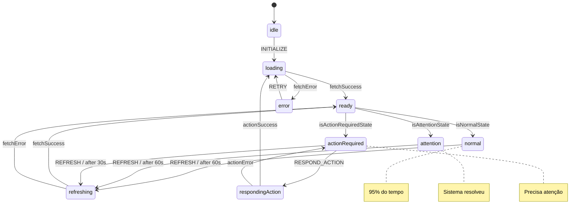

# State Machine - XState

## Visão Geral

O frontend utiliza **XState** para gerenciar o estado da aplicação. Isso garante transições previsíveis entre os 3 estados UX principais.

> **Filosofia**: O app só pode estar em um de 3 estados. Nada mais, nada menos.

---

## Estados da Aplicação

```
                                    ┌─────────────────┐
                                    │    LOADING      │
                                    │                 │
                                    │ • Iniciando     │
                                    │ • Validando     │
                                    └────────┬────────┘
                                             │
                                    ┌────────┴────────┐
                                    │                 │
                            ┌───────▼───────┐ ┌──────▼──────┐
                            │    READY      │ │   ERROR     │
                            │               │ │             │
                            │ Dashboard     │ │ Falha       │
                            │ carregado     │ │ crítica     │
                            └───────┬───────┘ └──────┬──────┘
                                    │                │
                     ┌──────────────┼──────────────┐ │
                     │              │              │ │
              ┌──────▼──────┐ ┌─────▼─────┐ ┌─────▼─────┐
              │   NORMAL    │ │ ATTENTION │ │  ACTION   │
              │             │ │           │ │ REQUIRED  │
              │ "Tudo certo"│ │ "Sistema  │ │ "Precisa  │
              │             │ │  resolveu"│ │ de você"  │
              └──────┬──────┘ └─────┬─────┘ └─────┬─────┘
                     │              │             │
                     └──────────────┴─────────────┘
                              │
                     ┌────────▼────────┐
                     │     REFRESH     │
                     │                 │
                     │ Atualizando...  │
                     └─────────────────┘
```

---

## Dashboard Machine

### Definição

```typescript
// src/machines/dashboardMachine.ts

import { createMachine, assign } from 'xstate';
import { dashboardService } from '../services/dashboard.service';

// Tipos
interface DashboardContext {
  session: LayersSession | null;
  state: 'NORMAL' | 'ATTENTION' | 'ACTION_REQUIRED';
  message: string;
  students: StudentSummary[];
  pendingActions: PendingAction[];
  error: string | null;
  lastUpdate: Date | null;
}

type DashboardEvent =
  | { type: 'INITIALIZE'; session: LayersSession }
  | { type: 'FETCH' }
  | { type: 'FETCH_SUCCESS'; data: DashboardResponse }
  | { type: 'FETCH_ERROR'; error: string }
  | { type: 'RESPOND_ACTION'; actionId: string; response: string }
  | { type: 'ACTION_SUCCESS'; newState: string }
  | { type: 'ACTION_ERROR'; error: string }
  | { type: 'REFRESH' }
  | { type: 'RETRY' };

// Machine
export const dashboardMachine = createMachine<DashboardContext, DashboardEvent>(
  {
    id: 'dashboard',
    initial: 'idle',
    context: {
      session: null,
      state: 'NORMAL',
      message: '',
      students: [],
      pendingActions: [],
      error: null,
      lastUpdate: null,
    },

    states: {
      // Estado inicial - aguardando LayersPortal
      idle: {
        on: {
          INITIALIZE: {
            target: 'loading',
            actions: 'setSession',
          },
        },
      },

      // Carregando dashboard
      loading: {
        invoke: {
          src: 'fetchDashboard',
          onDone: {
            target: 'ready',
            actions: 'setDashboardData',
          },
          onError: {
            target: 'error',
            actions: 'setError',
          },
        },
      },

      // Dashboard carregado - roteia para estado correto
      ready: {
        always: [
          { target: 'normal', cond: 'isNormalState' },
          { target: 'attention', cond: 'isAttentionState' },
          { target: 'actionRequired', cond: 'isActionRequiredState' },
        ],
      },

      // Estado NORMAL - 95% do tempo
      normal: {
        on: {
          REFRESH: 'refreshing',
          FETCH: 'loading',
        },
        after: {
          // Auto-refresh a cada 60 segundos
          60000: 'refreshing',
        },
      },

      // Estado ATTENTION - limite atingido
      attention: {
        on: {
          REFRESH: 'refreshing',
          FETCH: 'loading',
        },
        after: {
          60000: 'refreshing',
        },
      },

      // Estado ACTION_REQUIRED - precisa resposta
      actionRequired: {
        on: {
          RESPOND_ACTION: 'respondingAction',
          REFRESH: 'refreshing',
        },
        // Refresh mais frequente quando há ações
        after: {
          30000: 'refreshing',
        },
      },

      // Respondendo a uma ação
      respondingAction: {
        invoke: {
          src: 'respondToAction',
          onDone: {
            target: 'loading', // Recarrega dashboard
            actions: 'clearError',
          },
          onError: {
            target: 'actionRequired',
            actions: 'setActionError',
          },
        },
      },

      // Atualizando em background
      refreshing: {
        invoke: {
          src: 'fetchDashboard',
          onDone: {
            target: 'ready',
            actions: 'setDashboardData',
          },
          onError: {
            // Em erro de refresh, volta ao estado anterior
            target: 'ready',
          },
        },
      },

      // Erro crítico
      error: {
        on: {
          RETRY: 'loading',
        },
      },
    },
  },
  {
    // Ações
    actions: {
      setSession: assign({
        session: (_, event) => event.session,
      }),

      setDashboardData: assign((_, event) => ({
        state: event.data.state,
        message: event.data.message,
        students: event.data.students,
        pendingActions: event.data.pendingActions,
        lastUpdate: new Date(),
        error: null,
      })),

      setError: assign({
        error: (_, event) => event.data?.message || 'Erro desconhecido',
      }),

      setActionError: assign({
        error: (_, event) => event.data?.message || 'Erro ao processar ação',
      }),

      clearError: assign({
        error: null,
      }),
    },

    // Guardas (condições)
    guards: {
      isNormalState: (context) => context.state === 'NORMAL',
      isAttentionState: (context) => context.state === 'ATTENTION',
      isActionRequiredState: (context) => context.state === 'ACTION_REQUIRED',
    },

    // Serviços (side effects)
    services: {
      fetchDashboard: async (context) => {
        return dashboardService.getDashboard();
      },

      respondToAction: async (context, event) => {
        if (event.type !== 'RESPOND_ACTION') return;
        return dashboardService.respondToAction(event.actionId, event.response);
      },
    },
  }
);
```

---

## Uso com React

### Hook useMachine

```tsx
// src/App.tsx

import { useMachine } from '@xstate/react';
import { dashboardMachine } from './machines/dashboardMachine';

function App() {
  const [state, send, service] = useMachine(dashboardMachine);

  // Estado atual
  const currentState = state.value;

  // Contexto
  const { students, pendingActions, message, error } = state.context;

  // Verificar estado específico
  const isLoading = state.matches('loading');
  const isNormal = state.matches('normal');
  const hasError = state.matches('error');

  // Enviar eventos
  const handleRefresh = () => send('REFRESH');
  const handleRetry = () => send('RETRY');
  const handleAction = (actionId: string, response: string) => {
    send({ type: 'RESPOND_ACTION', actionId, response });
  };

  // ...
}
```

---

## Action Machine

Machine separada para gerenciar o fluxo de resposta a ações.

```typescript
// src/machines/actionMachine.ts

import { createMachine, assign } from 'xstate';

interface ActionContext {
  actionId: string;
  actionType: string;
  options: ActionOption[];
  selectedResponse: string | null;
  isSubmitting: boolean;
  error: string | null;
}

type ActionEvent =
  | { type: 'SELECT_RESPONSE'; response: string }
  | { type: 'CONFIRM' }
  | { type: 'CANCEL' }
  | { type: 'SUBMIT_SUCCESS' }
  | { type: 'SUBMIT_ERROR'; error: string };

export const actionMachine = createMachine<ActionContext, ActionEvent>({
  id: 'action',
  initial: 'idle',

  states: {
    // Aguardando seleção
    idle: {
      on: {
        SELECT_RESPONSE: {
          target: 'selected',
          actions: 'setSelectedResponse',
        },
        CANCEL: 'cancelled',
      },
    },

    // Resposta selecionada
    selected: {
      on: {
        SELECT_RESPONSE: {
          actions: 'setSelectedResponse',
        },
        CONFIRM: 'confirming',
        CANCEL: 'idle',
      },
    },

    // Confirmando
    confirming: {
      on: {
        CONFIRM: 'submitting',
        CANCEL: 'selected',
      },
    },

    // Enviando
    submitting: {
      entry: 'setSubmitting',
      invoke: {
        src: 'submitResponse',
        onDone: 'success',
        onError: {
          target: 'error',
          actions: 'setError',
        },
      },
    },

    // Sucesso
    success: {
      type: 'final',
    },

    // Erro
    error: {
      on: {
        CONFIRM: 'submitting',
        CANCEL: 'idle',
      },
    },

    // Cancelado
    cancelled: {
      type: 'final',
    },
  },
});
```

---

## Transições Visuais

### Animações entre Estados

```tsx
// src/components/StateTransition.tsx

import { motion, AnimatePresence } from 'framer-motion';

interface Props {
  state: 'NORMAL' | 'ATTENTION' | 'ACTION_REQUIRED';
  children: React.ReactNode;
}

const variants = {
  initial: { opacity: 0, y: 20 },
  animate: { opacity: 1, y: 0 },
  exit: { opacity: 0, y: -20 },
};

export function StateTransition({ state, children }: Props) {
  return (
    <AnimatePresence mode="wait">
      <motion.div
        key={state}
        variants={variants}
        initial="initial"
        animate="animate"
        exit="exit"
        transition={{ duration: 0.3 }}
      >
        {children}
      </motion.div>
    </AnimatePresence>
  );
}
```

---

## Persistência de Estado

### Salvar Estado Localmente

```typescript
// src/machines/persistence.ts

import { dashboardMachine } from './dashboardMachine';
import { interpret } from 'xstate';

const STORAGE_KEY = 'super-cantina-state';

// Restaurar estado do localStorage
export function getPersistedState() {
  try {
    const saved = localStorage.getItem(STORAGE_KEY);
    if (saved) {
      return JSON.parse(saved);
    }
  } catch {
    // Ignora erro de parse
  }
  return undefined;
}

// Criar service com persistência
export function createPersistedService() {
  const persistedState = getPersistedState();

  const service = interpret(dashboardMachine, {
    state: persistedState,
  });

  // Salvar a cada mudança de estado
  service.onTransition((state) => {
    if (state.changed) {
      try {
        localStorage.setItem(STORAGE_KEY, JSON.stringify(state));
      } catch {
        // Ignora erro de storage
      }
    }
  });

  return service;
}
```

---

## DevTools

### XState Inspector

```tsx
// src/main.tsx

import { inspect } from '@xstate/inspect';

// Habilitar apenas em desenvolvimento
if (import.meta.env.DEV) {
  inspect({
    url: 'https://stately.ai/viz?inspect',
    iframe: false, // Abre em nova aba
  });
}
```

---

## Diagrama de Estados (Mermaid)



---

## Testes da Machine

```typescript
// src/machines/__tests__/dashboardMachine.test.ts

import { interpret } from 'xstate';
import { dashboardMachine } from '../dashboardMachine';

describe('dashboardMachine', () => {
  it('deve iniciar no estado idle', () => {
    const service = interpret(dashboardMachine).start();
    expect(service.state.value).toBe('idle');
    service.stop();
  });

  it('deve transicionar para loading ao receber INITIALIZE', () => {
    const service = interpret(dashboardMachine).start();

    service.send({
      type: 'INITIALIZE',
      session: { token: 'test', userId: '1', communityId: '1', role: 'guardian', expiresAt: 0 },
    });

    expect(service.state.value).toBe('loading');
    service.stop();
  });

  it('deve ir para normal quando state é NORMAL', (done) => {
    const service = interpret(
      dashboardMachine.withConfig({
        services: {
          fetchDashboard: async () => ({
            state: 'NORMAL',
            message: 'Tudo certo',
            students: [],
            pendingActions: [],
          }),
        },
      })
    ).start();

    service.onTransition((state) => {
      if (state.matches('normal')) {
        expect(state.context.message).toBe('Tudo certo');
        done();
      }
    });

    service.send({
      type: 'INITIALIZE',
      session: { token: 'test', userId: '1', communityId: '1', role: 'guardian', expiresAt: 0 },
    });
  });

  it('deve ir para actionRequired quando há ações pendentes', (done) => {
    const service = interpret(
      dashboardMachine.withConfig({
        services: {
          fetchDashboard: async () => ({
            state: 'ACTION_REQUIRED',
            message: 'Precisa da sua atenção',
            students: [],
            pendingActions: [{ id: 'action-1', type: 'DIETARY_VIOLATION' }],
          }),
        },
      })
    ).start();

    service.onTransition((state) => {
      if (state.matches('actionRequired')) {
        expect(state.context.pendingActions).toHaveLength(1);
        done();
      }
    });

    service.send({
      type: 'INITIALIZE',
      session: { token: 'test', userId: '1', communityId: '1', role: 'guardian', expiresAt: 0 },
    });
  });

  it('deve processar resposta a ação', (done) => {
    const service = interpret(
      dashboardMachine.withConfig({
        services: {
          fetchDashboard: async () => ({
            state: 'ACTION_REQUIRED',
            message: '',
            students: [],
            pendingActions: [{ id: 'action-1', type: 'DIETARY_VIOLATION' }],
          }),
          respondToAction: async () => ({ success: true }),
        },
      })
    ).start();

    let passedThroughResponding = false;

    service.onTransition((state) => {
      if (state.matches('respondingAction')) {
        passedThroughResponding = true;
      }
      if (state.matches('loading') && passedThroughResponding) {
        done();
      }
    });

    service.send({
      type: 'INITIALIZE',
      session: { token: 'test', userId: '1', communityId: '1', role: 'guardian', expiresAt: 0 },
    });

    setTimeout(() => {
      service.send({
        type: 'RESPOND_ACTION',
        actionId: 'action-1',
        response: 'KEEP_BLOCKED',
      });
    }, 100);
  });
});
```

---

## Referências

- [XState Documentation](https://xstate.js.org/docs/)
- [Arquitetura Frontend](./arquitetura.md)
- [Componentes UX](./componentes-ux.md)
