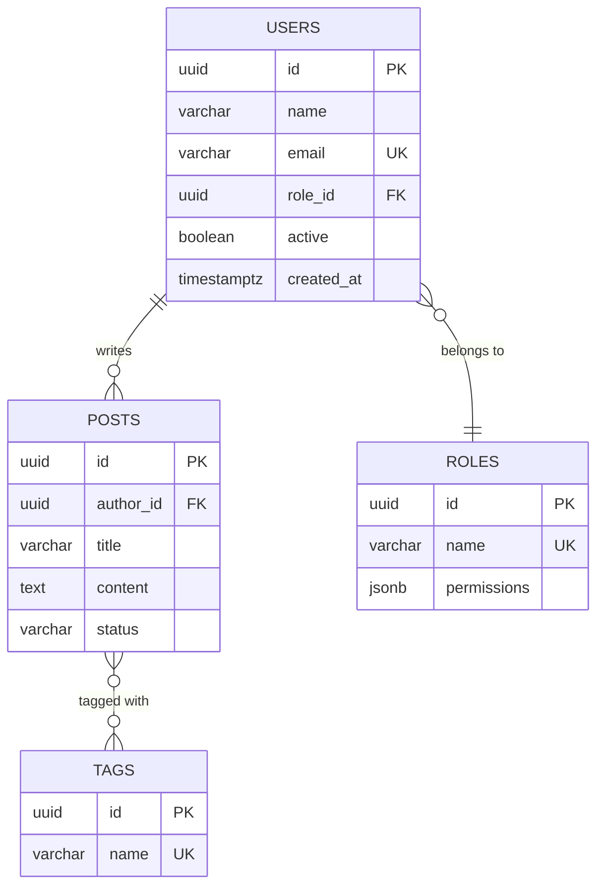

# Data Dictionary Skill

Gerar dicionarios de dados completos a partir de schemas existentes.

## Output Format

Cada tabela/entidade gera uma secao markdown:

```markdown
### users

Usuarios do sistema.

| Column | Type | Nullable | Default | Description | FK |
|--------|------|----------|---------|-------------|----|
| id | uuid | No | gen_random_uuid() | Primary key | - |
| name | varchar(100) | No | - | Nome completo | - |
| email | varchar(255) | No | - | Email unico | - |
| role_id | uuid | Yes | null | Perfil do usuario | roles.id |
| created_at | timestamptz | No | now() | Data de criacao | - |
| updated_at | timestamptz | No | now() | Data de atualizacao | - |

**Indexes**: `users_email_key` (UNIQUE on email), `users_role_id_idx` (on role_id)
**RLS**: Enabled — users can only read their own row
```

## From Drizzle Schema

```typescript
// Parse pgTable definitions
import { pgTable, uuid, varchar, timestamp, boolean } from 'drizzle-orm/pg-core';

export const users = pgTable('users', {
  id: uuid('id').defaultRandom().primaryKey(),
  name: varchar('name', { length: 100 }).notNull(),
  email: varchar('email', { length: 255 }).notNull().unique(),
  roleId: uuid('role_id').references(() => roles.id),
  active: boolean('active').default(true).notNull(),
  createdAt: timestamp('created_at', { withTimezone: true }).defaultNow().notNull(),
});
```

Extrair:
1. Nome da tabela: primeiro arg de `pgTable()`
2. Colunas: cada propriedade do objeto
3. Tipo: `uuid()`, `varchar()`, `timestamp()`, etc.
4. Nullable: presenca de `.notNull()` (default e nullable)
5. Default: `.default()`, `.defaultRandom()`, `.defaultNow()`
6. FK: `.references(() => table.column)`
7. Constraints: `.unique()`, `.primaryKey()`

## From Prisma Schema

```prisma
model User {
  id        String   @id @default(uuid())
  name      String
  email     String   @unique
  role      Role?    @relation(fields: [roleId], references: [id])
  roleId    String?
  posts     Post[]
  active    Boolean  @default(true)
  createdAt DateTime @default(now())
  updatedAt DateTime @updatedAt

  @@index([roleId])
  @@map("users")
}
```

Extrair:
1. Nome: `model Name` (ou `@@map` se presente)
2. Colunas: cada campo
3. Tipo: `String`, `Int`, `DateTime`, etc.
4. Nullable: `?` suffix
5. Default: `@default()`
6. FK: `@relation(fields: [...], references: [...])`
7. Indexes: `@@index([])`
8. Relacoes: campos com tipo de outro model

## From SQL (CREATE TABLE)

```sql
CREATE TABLE users (
    id UUID PRIMARY KEY DEFAULT gen_random_uuid(),
    name VARCHAR(100) NOT NULL,
    email VARCHAR(255) NOT NULL UNIQUE,
    role_id UUID REFERENCES roles(id),
    active BOOLEAN NOT NULL DEFAULT true,
    created_at TIMESTAMPTZ NOT NULL DEFAULT now(),
    updated_at TIMESTAMPTZ NOT NULL DEFAULT now()
);

CREATE INDEX idx_users_role ON users(role_id);
CREATE INDEX idx_users_email ON users(email);
```

Extrair via regex patterns:
- `CREATE TABLE (\w+)` — nome
- Cada linha dentro dos parenteses — coluna
- `NOT NULL` — not nullable
- `DEFAULT` — valor padrao
- `REFERENCES table(col)` — FK
- `PRIMARY KEY`, `UNIQUE` — constraints
- `CREATE INDEX` statements — indexes

## From TypeScript Types

```typescript
interface User {
  id: string;
  name: string;
  email: string;
  roleId?: string;
  active: boolean;
  createdAt: Date;
  updatedAt: Date;
}
```

Mapeamento de tipos:
| TS Type | SQL Type | Notes |
|---------|----------|-------|
| string | varchar/text | Sem length info |
| number | integer/numeric | Sem precisao |
| boolean | boolean | - |
| Date | timestamptz | - |
| string (com uuid pattern) | uuid | Se nome termina em `Id` |
| optional (?) | nullable | - |
| array | relation 1:N | - |

## Relationships Section

```markdown
## Relationships

| From | To | Type | FK Column | Description |
|------|----|------|-----------|-------------|
| users | roles | N:1 | users.role_id | User belongs to role |
| users | posts | 1:N | posts.author_id | User has many posts |
| posts | tags | N:M | post_tags (junction) | Posts have many tags |
```

## Indexes Section

```markdown
## Indexes

| Table | Name | Columns | Type | Description |
|-------|------|---------|------|-------------|
| users | users_pkey | id | PRIMARY | - |
| users | users_email_key | email | UNIQUE | Prevent duplicate emails |
| users | idx_users_role | role_id | INDEX | Speed up role queries |
| posts | idx_posts_author | author_id | INDEX | Speed up author lookup |
```

## Enums Section

```markdown
## Enums

### user_role
| Value | Description |
|-------|-------------|
| admin | Full system access |
| teacher | Teaching access |
| student | Student access |
| parent | Parent/guardian access |
```

## ER Diagram Generation

Gerar Mermaid erDiagram automaticamente a partir do dicionario:



## Template Completo

```markdown
# Data Dictionary — [Project Name]

**Generated**: YYYY-MM-DD
**Source**: [schema path]
**Database**: PostgreSQL 16 / SQLite / MySQL

## Overview

| Table | Rows (est.) | Description |
|-------|-------------|-------------|
| users | ~1,000 | System users |
| posts | ~10,000 | User content |
| roles | 4 | Permission roles |

## ER Diagram

[Mermaid erDiagram here]

## Tables

### users
[column table]

### posts
[column table]

## Relationships
[relationship table]

## Indexes
[index table]

## Enums
[enum tables]

## Changelog
| Date | Change | Author |
|------|--------|--------|
| 2026-03-26 | Initial generation | Claude |
```

## Regras de Uso

1. Sempre incluir ER diagram Mermaid
2. Toda coluna com descricao (mesmo que inferida do nome)
3. FKs documentadas com tabela.coluna de destino
4. Indexes listados separadamente
5. Enums com todos os valores possiveis
6. Se schema incompleto, marcar campos como "TODO: verify"
