# Diagram Skill

Gerar diagramas tecnicos com Mermaid (preferido), PlantUML ou D2.

## Decision Matrix

| Diagram Type | Best Tool | Reason |
|-------------|-----------|--------|
| Flowchart | Mermaid | Simples, renderiza direto |
| Sequence | Mermaid | Excelente suporte |
| ER / Data Model | Mermaid | erDiagram nativo |
| Class | Mermaid | classDiagram nativo |
| Gantt | Mermaid | gantt nativo |
| State Machine | Mermaid | stateDiagram-v2 |
| Architecture (complex) | D2 | Melhor layout para diagramas grandes |
| Deployment | PlantUML | Mais icons de infra |
| C4 Model | PlantUML | Plugin C4 dedicado |

## Rendering

Usar o MCP tool `mcp__mermaid__generate` para renderizar diagramas como PNG/SVG:

```
mcp__mermaid__generate({
  code: "flowchart LR\n  A --> B",
  name: "my-diagram",
  outputFormat: "png",
  theme: "default",
  folder: "/tmp"
})
```

Temas disponiveis: `default`, `forest`, `dark`, `neutral`

## Mermaid Syntax

### Flowchart
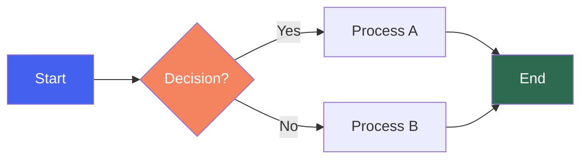

Direcoes: `TB` (top-bottom), `BT`, `LR` (left-right), `RL`

Shapes: `[rect]`, `(rounded)`, `{diamond}`, `([stadium])`, `[[subroutine]]`, `[(cylinder)]`, `((circle))`, `>flag]`, `{hexagon}`

### Sequence Diagram
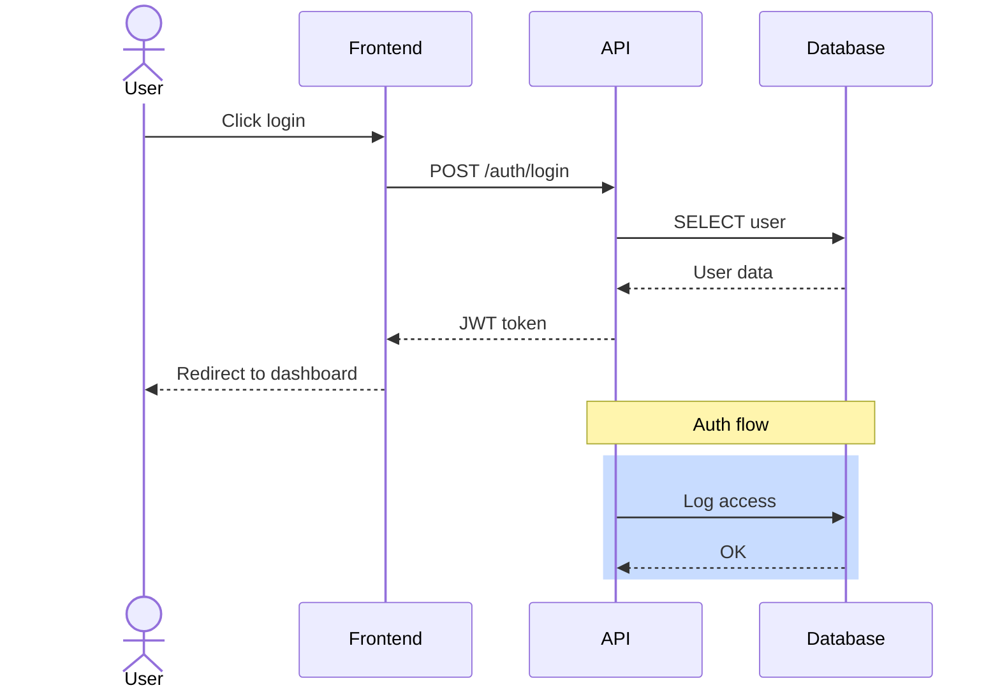

Arrows: `->>` (solid), `-->>` (dashed), `-x` (cross), `-)` (async)

### Class Diagram
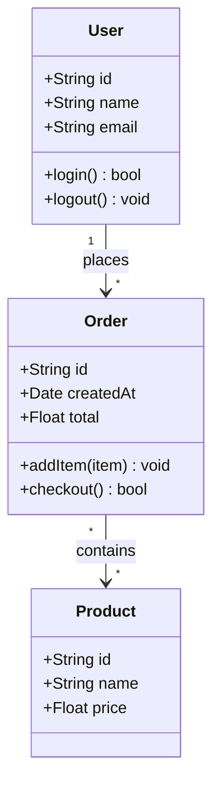

### ER Diagram
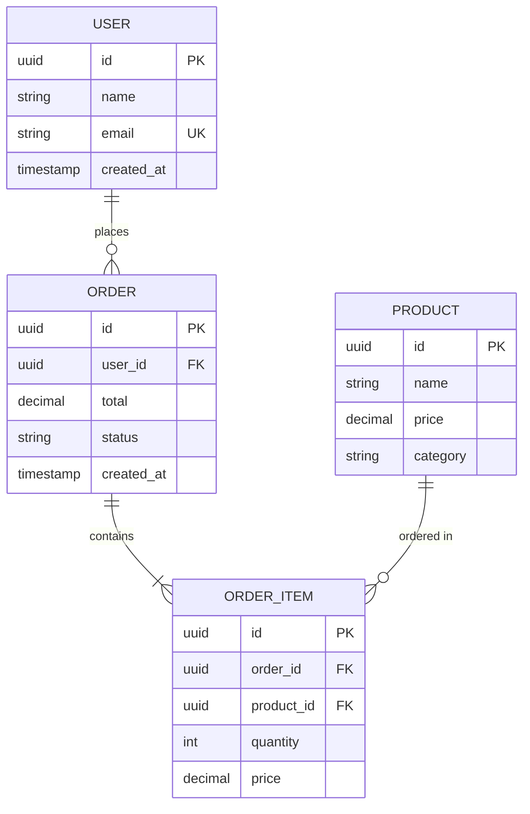

Relationships: `||--||` (one-to-one), `||--o{` (one-to-many), `}o--o{` (many-to-many)

### Gantt
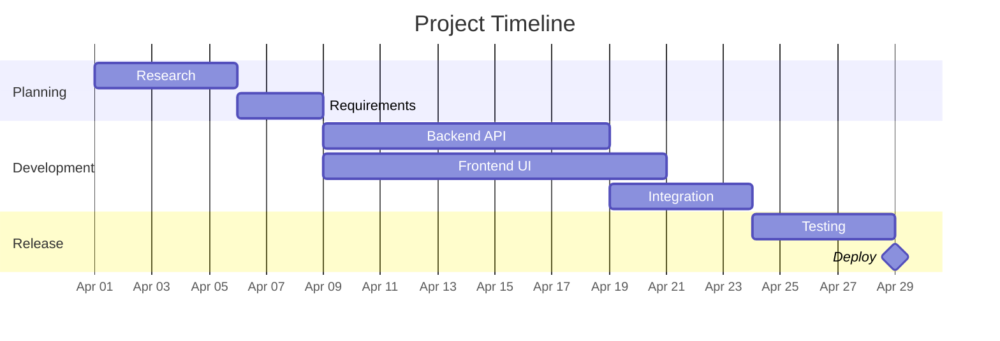

### State Diagram
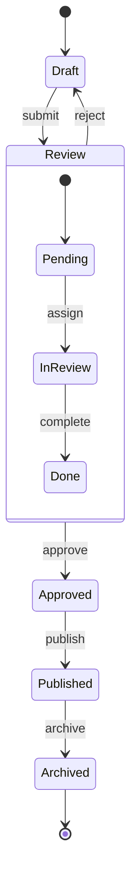

### Pie Chart
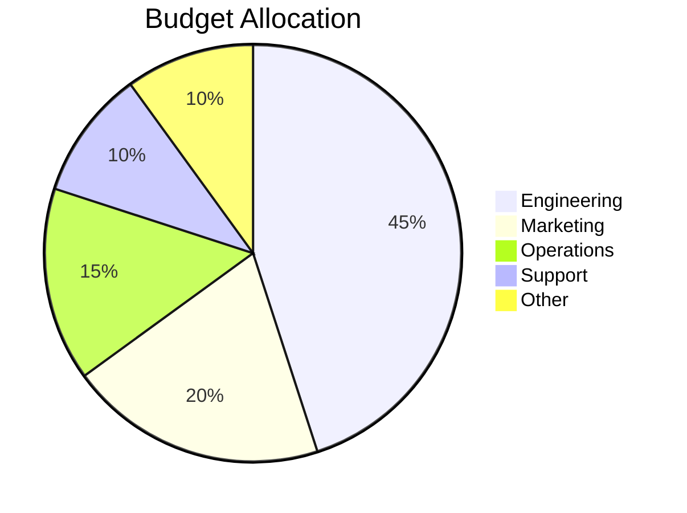

### User Journey
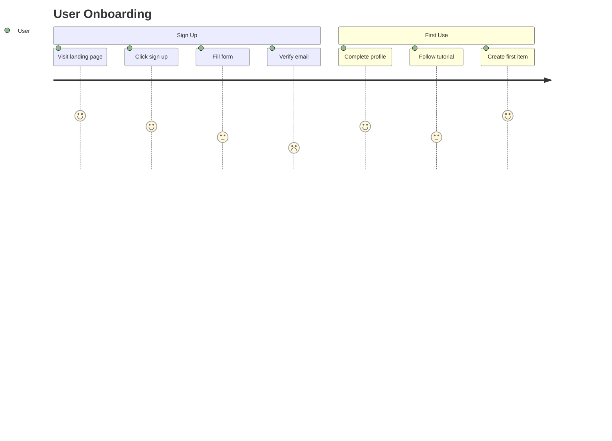

## Common Templates

### API Flow
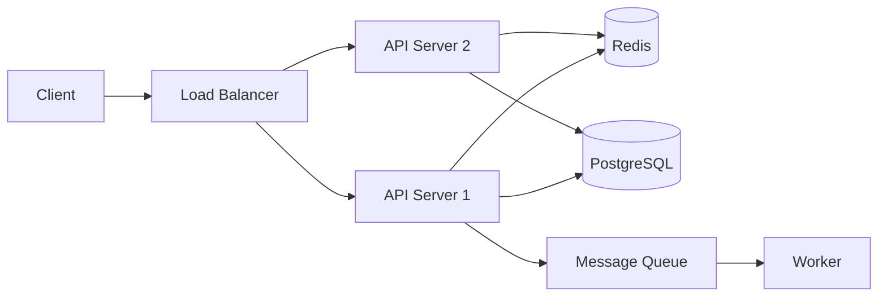

### Auth Flow
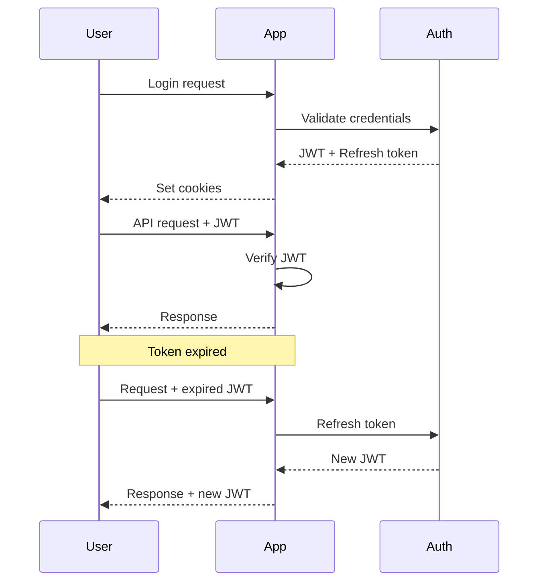

### Deploy Pipeline
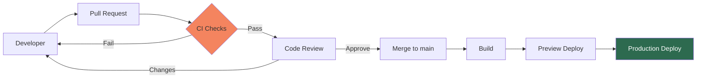

## Best Practices

1. **Direcao**: LR (left-to-right) para fluxos, TB para hierarquias
2. **Max nodes**: 15 por diagrama — dividir se maior
3. **Cores**: Usar sparingly, apenas para enfase (max 3 cores)
4. **Labels**: Curtos e descritivos (max 3 palavras)
5. **Agrupamento**: Usar subgraphs para agrupar componentes relacionados
6. **Consistencia**: Mesmo estilo de shapes para mesma categoria
7. **Notes**: Adicionar notas explicativas em sequence diagrams
8. **Renderizar**: Sempre gerar imagem via MCP para validacao visual

## Regras de Uso

1. Mermaid como primeira escolha (renderiza via MCP)
2. Validar sintaxe antes de renderizar
3. Max 15 nodes por diagrama
4. Sempre especificar direcao (LR, TB, etc.)
5. Usar cores com parcimonia — max 3 destaques
6. Salvar tanto o source (.mmd) quanto a imagem (.png)
