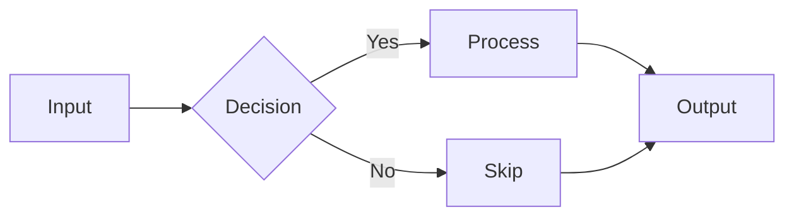
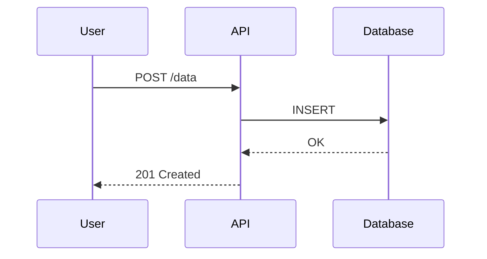
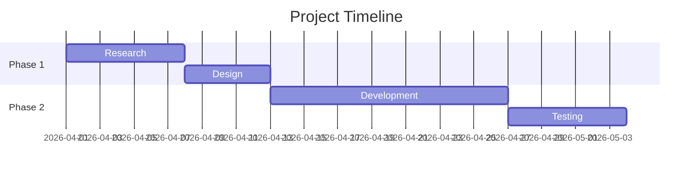
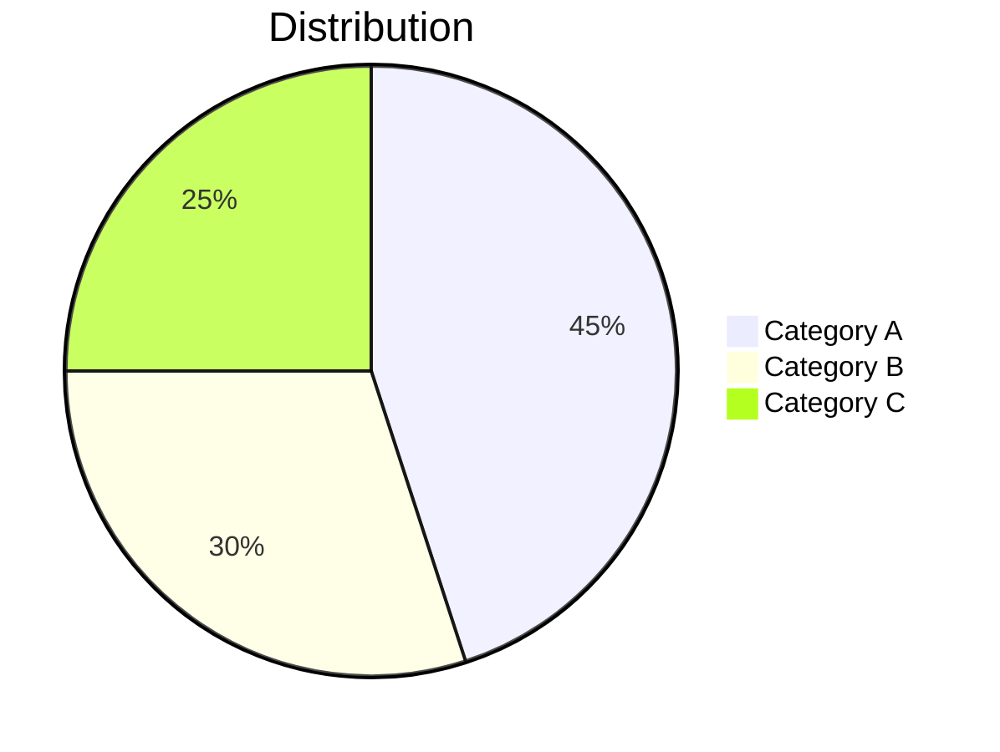

# Markdown Report Skill

Gerar relatorios estruturados e profissionais em Markdown.

## Estrutura Padrao

```markdown
---
title: "Report Title"
author: "Author Name"
date: "2026-03-26"
version: "1.0"
status: "draft|review|final"
---

# Report Title

> One-line summary of the report purpose.

## Table of Contents

- [Section 1](#section-1)
- [Section 2](#section-2)
- [Appendix](#appendix)

---

## Section 1

Content here.

## Section 2

Content here.

---

## Appendix

Supporting data, references, raw data.
```

## Templates por Tipo

### Relatorio Tecnico
```markdown
# [Titulo] — Technical Report

**Date**: YYYY-MM-DD | **Author**: Name | **Status**: Draft

## Executive Summary
- Key finding 1
- Key finding 2
- Recommendation

## Context
Why this analysis was needed.

## Methodology
How the analysis was conducted.

## Findings

### Finding 1: [Title]
**Severity**: High/Medium/Low
**Impact**: Description
**Evidence**: Data/screenshots

### Finding 2: [Title]
...

## Recommendations

| # | Action | Priority | Effort | Impact |
|---|--------|----------|--------|--------|
| 1 | Do X   | P0       | Low    | High   |
| 2 | Do Y   | P1       | Medium | Medium |

## Next Steps
- [ ] Action item 1
- [ ] Action item 2

## References
- [Link 1](url)
- [Link 2](url)
```

### Relatorio Executivo
```markdown
# [Titulo] — Executive Summary

**Period**: Month YYYY | **Prepared for**: Stakeholder

## Highlights
- Metric 1: **+15%** vs last period
- Metric 2: **3 of 5** milestones completed
- Risk: [brief description]

## Key Metrics

| Metric | Target | Actual | Status |
|--------|--------|--------|--------|
| Revenue | $100K | $115K | On Track |
| Users | 1000 | 850 | At Risk |

## Decisions Needed
1. **[Decision 1]**: Options A vs B — recommend A because...
2. **[Decision 2]**: Approve budget for...
```

### Sprint Review
```markdown
# Sprint Review — Sprint N (YYYY-MM-DD)

## Summary
- **Velocity**: X points completed / Y planned
- **Completion**: X%
- **Carryover**: N items

## Completed

| Issue | Title | Points | PR |
|-------|-------|--------|----|
| #123 | Feature X | 5 | #456 |
| #124 | Fix Y | 3 | #457 |

## Not Completed

| Issue | Title | Reason | Next Sprint? |
|-------|-------|--------|--------------|
| #125 | Feature Z | Blocked by API | Yes |

## Metrics
- Bugs found: N
- Tech debt addressed: N items
- Test coverage: X% → Y%

## Retrospective
- **Keep**: What worked well
- **Improve**: What needs improvement
- **Action**: Specific next steps
```

## Tabelas

```markdown
<!-- Left-aligned (default) -->
| Column 1 | Column 2 | Column 3 |
|----------|----------|----------|
| Value    | Value    | Value    |

<!-- Right-aligned numbers -->
| Item     | Quantity | Price    |
|----------|--------:|---------:|
| Widget A |      10 |   $5.00  |
| Widget B |      25 |  $12.50  |

<!-- Center-aligned -->
| Status   | Count    | Trend    |
|:--------:|:--------:|:--------:|
| OK       | 42       | Up       |
```

## Mermaid Diagrams

Usar `mcp__mermaid__generate` para renderizar como imagem.

### Flowchart


### Sequence Diagram


### Gantt


### Pie Chart


## Badges / Shields

```markdown


```

## Checklists

```markdown
## Progress Tracker

- [x] Phase 1: Research complete
- [x] Phase 2: Design approved
- [ ] Phase 3: Implementation (in progress)
- [ ] Phase 4: Testing
- [ ] Phase 5: Deploy
```

## Callouts / Admonitions

GitHub-flavored callouts:

```markdown
> [!NOTE]
> Informacao adicional que o leitor deve saber.

> [!TIP]
> Dica util para melhorar o resultado.

> [!IMPORTANT]
> Informacao crucial para o sucesso.

> [!WARNING]
> Atencao necessaria para evitar problemas.

> [!CAUTION]
> Risco de danos ou perda de dados.
```

## Best Practices

1. **Max 80 chars por linha** — facilita diff e leitura em terminal
2. **Headings semanticos** — H1 para titulo, H2 para secoes, H3 para subsecoes (nunca pular nivel)
3. **Links relativos** para docs internos, absolutos para externos
4. **Uma linha em branco** antes e depois de headings, code blocks, tabelas
5. **Listas**: usar `-` (nao `*`), indentar sub-itens com 2 espacos
6. **Code blocks**: sempre especificar linguagem (```python, ```bash, ```typescript)
7. **Tabelas**: alinhar pipes para legibilidade no source
8. **Imagens**: alt text descritivo, tamanho razoavel
9. **TOC**: gerar automaticamente para docs com 3+ secoes
10. **Frontmatter**: incluir em docs formais (title, date, status)

## Regras de Uso

1. Escolher template adequado ao tipo de relatorio
2. Sempre incluir Executive Summary para relatorios > 1 pagina
3. Dados quantitativos em tabelas, nao em paragrafos
4. Diagramas Mermaid para fluxos e arquiteturas
5. Callouts para informacoes criticas (WARNING, CAUTION)
6. Verificar que todos os links internos funcionam
